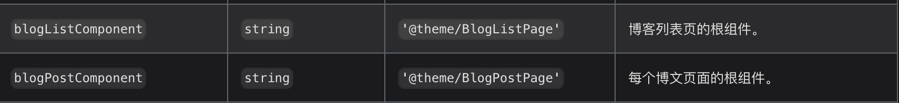

大概是 2020 年因为疫情，只能在家上网课，空余时间很多，就使用 wordpress + 阿里云服务器搭建了一个博客网站，但是因为自制力不强，把网站搭建起来之后也就没有管理过了，直到去年域名过期了，再加上工作之后积累的一些经验和知识都被零散化的记录在了本地电脑上，所以这又萌生出了搭建一个个人博客网站的念头。用这个博客记录一下自己使用 Docusaurus 搭建博客网站的过程，以及搭建博客网站的步骤。当然采用 Docusaurus 的另一个原因也是在 B 站上看到了 UP 主 [峰华前端工程师](https://www.bilibili.com/video/BV1uE411x7mE?) 的这个视频。

<!--truncate-->

## Docusaurus 介绍

官网简介：[Docusaurus](https://docusaurus.io/zh-CN/docs) 是一款静态站点生成器。 可以搭建带有快速客户端导航的单页应用，充分利用了 React，让你的网站具有交互能力。 它提供了开箱即用的文档功能，不过也可用于搭建各种网站（个人网站、产品、博客、营销主页，等等）。

## 搭建流程

搭建流程官网上有详细的介绍，这里我会把步骤和我遇到的问题，踩过的坑记录下来。

1. 安装 Docusaurus
   首先确保电脑有 node 环境，这里关于 node 环境的安装不做赘述。

```bash
npx create-docusaurus@latest my-website classic
```

2. 目录结构
   下面是主要目录的介绍：

```bash
├── babel.config.js
├── blog
│   ├── 2020-02-21-first-blog.md   # 博客文件
│   └── img                        # 博客图片
├── docs
│   └── doc1.md                    # 文档
├── docusaurus.config.js
├── package.json
├── sidebars.js
├── src
│   ├── components                 # 自定义组件
│   ├── css                        # 自定义 CSS
│   ├── pages                      # 自定义页面
├── static
│   ├── icons                      # 公用图标
│   ├── img                        # 公用图片（以及遗留的博客图片）
└── yarn.lock
```

3. 运行网站

```bash
cd my-website
yarn start
```

这里我使用的是 yarn，如果你使用的是 npm，那么就改成 npm start。

恭喜你 🎉，你已经搭建成功了，你可以在浏览器中访问你的网站了。http://localhost:3000

没想到吧，搭建一个网站是这么简单，默认的网站是这个样子。


3. 配置文件修改
   默认的界面包括文档部分和博客部分，如果你只需要其中的某一个，可以直接在 `docusaurus.config.js` 中修改。

```js
module.exports = {
  // ...
  presets: [
    [
      "@docusaurus/preset-classic",
      {
        docs: false, // 可选：禁用文档插件
        blog: {
          routeBasePath: "/", // 把博客放在站点根部
          /* 其他博客选项 */
        },
      },
    ],
  ],
};
```

我配置了仅博客模式，所以我把文档部分禁用了。

`docusaurus.config.js` 中具体的配置可以参考[这里](https://docusaurus.io/zh-CN/docs/api/docusaurus-config)。

4. 更改默认博客页面布局
   博客默认界面是这个样子的，如果不喜欢这个布局的话可以进行更改。


博客部分的具体配置是使用了 `plugin-content-blog` 这个插件。这个插件默认集成在了 `@docusaurus/preset-classic` 里，我们不用进行下载。关于插件的配置可以参考[这里](https://docusaurus.io/zh-CN/docs/api/plugins/@docusaurus/plugin-content-blog)。

配置接受这两个字段，`blogListComponent` 和 `blogPostComponent`。



以 `blogListComponent` 为例子，默认是 `@theme/BlogListPage`， 我们只需要在 `src/` 下新建一个 `theme/BlogListPage/index.js` 然后修改成自己想要的样式布局即可。

> 新建文件之后一定要重新 `yarn start` 否则不会生效，加载的还是 `@docusaurus/preset-classic` 中的对应文件。
> 先找到默认 `BlogListPage` 这个文件，把源码复制到新建的文件中，这里面包含着拿到博客文章等一些其他的逻辑，可以根据源码进行一些其它的样式方面的修改。

## 待续

以上就是我目前搭建博客的一个基本步骤，但是大部分都是参考官方文档和峰华大佬的源码进行配置的。如果只是单纯的博客对界面没有要求的小伙伴们，可以去写起来了。下一步是更新这个博客的界面和一些其它配置，我会更新在这篇博客中。

有什么想交流的小伙伴可以联系我哦 **skyler151096@gmail.com**
